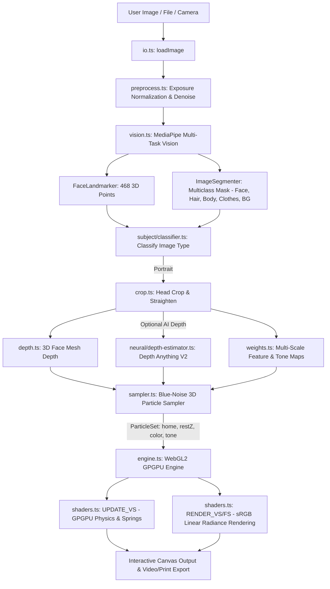

# Face Particles: 2D-to-3D Interactive Volumetric Particle Cloud
## Complete System Architecture, Codebase Map, Processing Pipelines & Technical Problem Analysis

---

## 1. Executive Summary & Project Description

**Face Particles** is a real-time, client-side WebGL2 / Three.js interactive application that transforms any 2D photograph, portrait, pet image, handwriting/signature, or graphic into a dynamic **3D volumetric particle field** (ranging from 50,000 to 120,000 discrete physical particles).

### Core Capabilities
1. **2D-to-3D Volumetric Transformation**: Converts flat 2D image coordinates into rich 3D metric coordinates ($X, Y, Z$) using MediaPipe 468-point Face Mesh geometry and optional ViT-based **Depth Anything V2** monocular depth estimation.
2. **Blue-Noise Importance Sampling**: Distributes particles across the image with blue-noise frequency distribution, placing denser particles on high-frequency anatomical features (eyes, lips, nostrils, hair contours, facial boundaries) and softer density on flat surfaces.
3. **Photorealistic Color & Tone Fidelity**: Directly samples 24-bit sRGB camera pixels into per-particle color vectors. Uses linear radiance scaling in WebGL shaders with premultiplied alpha to prevent hue shifting, oversaturation, or darkening.
4. **GPGPU Physics & Transform Feedback**: Simulates spring dynamics, spatial turbulence, cursor/touch perturbation, and kinetic animations (Explosion/Burst, Celestial Stream, Vortex, Orbit) entirely on the GPU at 60–120 FPS.
5. **Universal Subject Support**: Dynamically classifies and adapts to human faces, pets/animals, objects, signatures, text, and graphics.
6. **Zero-Server Privacy**: 100% of computer vision, neural depth, background segmentation, physics simulation, and video/still rendering runs on the client device inside the browser.

---

## 2. Codebase Map & Directory Structure

```
src/
├── components/
│   ├── ui/                                # Base UI components (Button, Slider, Switch, Dialog)
│   └── face-particles/
│       ├── app.tsx                        # Main UI controller, canvas orchestrator, top bar, & sidebar controls
│       ├── eraser-toolbar.tsx             # Interactive 3D particle eraser & sculpting tools
│       ├── print-dialog.tsx               # High-res print rasterizer & PDF/PNG export dialog
│       ├── record-dialog.tsx              # MP4/WebM video export settings (including 9:16 WhatsApp format)
│       ├── share-dialog.tsx               # Share link generator with URL hash serialization
│       ├── shared-particle-loader.tsx     # Cloud/URL loader for shared particle configurations
│       └── text-dialog.tsx                # Text & typography 3D particle generator modal
├── lib/
│   ├── utils.ts                           # Tailwind CSS class merging utilities (cn)
│   └── face-particles/
│       ├── background-cleaner.ts          # Document, ink, and background noise removal
│       ├── blue-noise.ts                  # Blue-noise 64x64 texture generator & spatial stippling
│       ├── config.ts                      # Default simulation constants, particle bounds, sample presets
│       ├── crop.ts                        # Anatomical head & subject bounding box cropper
│       ├── depth.ts                       # Fast 468-point MediaPipe Face Mesh + dome depth interpolator
│       ├── engine.ts                      # WebGL2 engine, GPGPU Transform Feedback, VAOs, animation loop
│       ├── eraser.ts                      # Raycast intersection & particle deletion physics
│       ├── io.ts                          # Image & URL loading with EXIF orientation correction
│       ├── landmarks.ts                   # MediaPipe landmark indices, feature groups, and contours
│       ├── math.ts                        # Math utilities (clamps, smoothsteps, 2D/3D hash functions)
│       ├── pipeline.ts                    # Master 2D-to-3D transformation pipeline orchestrator
│       ├── preprocess.ts                  # Exposure normalization, bilateral denoising, super-resolution
│       ├── print.ts                       # Offline 4K/8K particle rendering for high-DPI printing
│       ├── procedural.ts                  # Procedural geometric fallback patterns (sine waves, domes)
│       ├── record.ts                      # Real-time WebCodecs / MediaRecorder video recorder
│       ├── sampler.ts                     # Blue-noise pixel sampling, 3D coordinate mapping & color extraction
│       ├── serialize.ts                   # URL hash compression & binary particle serialization
│       ├── shaders.ts                     # WebGL2 GLSL shaders (GPGPU Update VS & Premultiplied Render FS)
│       ├── straighten.ts                  # Roll angle correction & facial upright alignment
│       ├── types.ts                       # TypeScript interfaces for particles, parameters, and vision results
│       ├── vision.ts                      # MediaPipe FaceLandmarker and ImageSegmenter initializer
│       ├── weights.ts                     # Feature importance, edge detection, and tonal weighting maps
│       ├── neural/
│       │   ├── depth-estimator.ts         # Depth Anything V2 (ONNX/WebGPU) monocular depth estimator
│       │   └── model-cache.ts             # Cache manager for neural weights in IndexedDB
│       └── subject/
│           ├── animal-adapter.ts          # Animal & pet morphological particle adapter
│           ├── classifier.ts              # Classifies image into Face vs Text vs Animal vs Object
│           ├── face-adapter.ts            # Facial anatomical field constructor
│           ├── graphic-adapter.ts         # Vector, sketch, and graphic particle adapter
│           ├── object-adapter.ts          # Generic inanimate object adapter
│           ├── subject-field.ts           # Unified subject interface & depth field abstraction
│           └── text-adapter.ts            # 2D canvas text rasterizer to 3D particle field
```

---

## 3. Lifecycle & Connection Graph



---

## 4. Key Code Snippets & Algorithms

### 4.1 Vision & Segmentation (`src/lib/face-particles/vision.ts`)
MediaPipe initializes both the 468-point 3D Face Landmarker and the Multiclass Image Segmenter:

```typescript
export async function analyze(source: HTMLCanvasElement): Promise<VisionResult> {
  const [landmarker, segmenter] = await Promise.all([
    initLandmarker(),
    initSegmenter()
  ]);

  // 1. Detect 468 anatomical 3D landmark points
  const lmRes = landmarker ? landmarker.detect(source) : null;
  const rawLandmarks = lmRes?.faceLandmarks?.[0] ?? [];

  // 2. Multiclass Segmentation (Class 1: Hair, Class 2: Body, Class 3: Face, Class 4: Clothes)
  let mask: Float32Array;
  if (segmenter) {
    const segRes = segmenter.segment(source);
    mask = extractForegroundMask(segRes, source.width, source.height);
  }

  return { landmarks: rawLandmarks, mask, width: source.width, height: source.height };
}
```

---

### 4.2 Standard 3D Face Mesh Depth (`src/lib/face-particles/depth.ts`)
Converts the 468 3D ($X, Y, Z$) landmarks into a continuous, smooth anatomical depth map:

```typescript
export function meshDomeDepth(crop: CropResult): Float32Array {
  const { width: w, height: h, landmarks, mask, iod } = crop;
  const depth = new Float32Array(w * h);

  // 1. Interpolate MediaPipe 3D landmark coordinates (Z is metric depth)
  if (landmarks && landmarks.length >= 468) {
    interpolateFaceMesh(depth, landmarks, w, h);
  }

  // 2. Synthesize anatomical cranium dome & jaw curvature
  applyAnatomicalDome(depth, landmarks, w, h, iod);

  // 3. Distortion Guard: suppresses artificial ballooning using discrete 2D Laplacian curvature
  return applyDistortionGuard(depth, w, h, 0.045);
}
```

---

### 4.3 AI Monocular Depth: Depth Anything V2 (`src/lib/face-particles/neural/depth-estimator.ts`)
Runs client-side Vision Transformer (ViT) monocular depth estimation via ONNX Runtime Web / WebGPU:

```typescript
export async function computeNeuralDepthAsync(
  crop: CropResult,
  onProgress?: (progress: number, stage: string) => void,
): Promise<Float32Array> {
  const { width: outW, height: outH, canvas, mask } = crop;
  
  // Load ONNX quantized model with WebGPU / WASM fallback
  const { pipeline, env } = await import("@huggingface/transformers");
  env.allowLocalModels = false;
  
  const depthEstimator = await pipeline(
    "depth-estimation",
    "onnx-community/depth-anything-v2-small",
    { device: "webgpu", dtype: "q8", progress_callback: onProgress }
  );

  const result = await depthEstimator(canvas);
  const rawDepth = result.depth; // Dense per-pixel depth map

  // Resample & normalize to [0.0 (far), 1.0 (near)]
  const depth = resampleAndNormalize(rawDepth, outW, outH);
  
  // Modulate with foreground mask to prevent depth bleeding
  for (let i = 0; i < outW * outH; i++) {
    depth[i] = depth[i] * (0.2 + 0.8 * mask[i]);
  }

  return depth;
}
```

---

### 4.4 Blue-Noise Importance Sampling & sRGB Color Extraction (`src/lib/face-particles/sampler.ts`)
Picks the most salient pixels and maps them into 3D space with exact sRGB color values:

```typescript
export function sample(
  maps: WeightMaps,
  depth: Float32Array,
  crop: CropResult,
  nMax = 80000,
): ParticleSet {
  const { width: w, height: h, weight, tone } = maps;
  const noise = getBlueNoise();
  const nPix = w * h;

  // Monotonic Blue-Noise thresholding for uniform spatial distribution
  const sorted = sortPixelsByImportance(weight, noise, w, h);
  const count = Math.min(nMax, sorted.length);

  const home = new Float32Array(count * 3);
  const color = new Uint8Array(count * 3);
  const px = crop.imageData.data;
  const aspect = h / w;

  for (let i = 0; i < count; i++) {
    const pi = sorted[i];
    const x = pi % w;
    const y = (pi / w) | 0;

    // Normalised WebGL clip coordinates [-1, 1]
    home[i * 3]     = ((x + 0.5) / w) * 2 - 1;
    home[i * 3 + 1] = -(((y + 0.5) / h) * 2 - 1) * aspect;
    
    // Metric Z Depth
    const z01 = depth[pi] ?? 0;
    home[i * 3 + 2] = (z01 - 0.30) * 0.65;

    // Extract exact 24-bit sRGB color channels (0-255)
    const p = pi * 4;
    color[i * 3]     = px[p];     // R
    color[i * 3 + 1] = px[p + 1]; // G
    color[i * 3 + 2] = px[p + 2]; // B
  }

  return { count, home, color, tone: toneOut, ... };
}
```

---

### 4.5 WebGL2 Render & Shaders (`src/lib/face-particles/shaders.ts`)
Vertex and Fragment shaders that preserve 100% true color ratios without hue shift:

```glsl
// RENDER VERTEX SHADER
#version 300 es
layout(location = 0) in vec3 aPos;
layout(location = 1) in float aTone;
layout(location = 3) in vec3 aColor;

uniform mat4 uViewProj;
uniform float uRadiance;
out vec3 vColor;
out float vBright;

void main() {
  gl_Position = uViewProj * vec4(aPos, 1.0);
  gl_PointSize = uSize * uDpr;

  // Linear radiance scaling across all 3 channels preserves exact R:G:B ratios
  // Eliminates unnatural orange tinting or color shifts!
  vColor = clamp(aColor * uRadiance, 0.0, 1.0);
  vBright = 0.88 + 0.12 * depthScale;
}

// RENDER FRAGMENT SHADER
#version 300 es
precision highp float;
in vec3 vColor;
in float vBright;
out vec4 fragColor;

void main() {
  vec2 p = gl_PointCoord * 2.0 - 1.0;
  float r2 = dot(p, p);
  if (r2 > 1.0) discard;

  // Premultiplied alpha Gaussian stipple prevents color clipping on overlap
  float a = clamp(exp(-r2 * 2.8) * vBright, 0.0, 1.0);
  fragColor = vec4(vColor * a, a);
}
```

---

## 5. Technical Problems & Challenges

### Problem 1: Background Removal vs. Subject Preservation
* **The Issue**: When using general-purpose neural background removers (such as ISNet / `@imgly/background-removal`), shadowed areas on the face, dark eye sockets, dark beards, and black clothing were incorrectly classified as "background" and erased (`alpha = 0`), creating hollow black eye holes and missing chins.
* **Current Solution**: MediaPipe’s **Multiclass Neural Segmenter** was restored. It specifically identifies human anatomical categories (`Class 1: Hair, Class 2: Body, Class 3: Face, Class 4: Clothes`), cleanly eliminating background walls/posters while retaining 100% of the face, beard, and shirt.
* **Open Discussion Question**: How to implement sub-pixel matte refinement (e.g. Guided Filter or Fast Bilateral Solver) along fine hair boundaries without incurring latency or misclassifying dark facial hair?

---

### Problem 2: Depth Estimation Tradeoffs
* **Fast 3D Mesh (MediaPipe 468-point)**:
  * *Pros*: Extremely fast (<30ms), guaranteed anatomical facial stability (eyes, nose, mouth stay structurally rigid), no shadow warping.
  * *Cons*: Only covers the face from forehead to chin; does not estimate depth for ears, hair volume, neck, clothing, shoulders, or non-human objects.
* **Dense Monocular Depth (Depth Anything V2)**:
  * *Pros*: Generates true continuous depth for the entire scene (hair, torso, pets, objects).
  * *Cons*: Quantized ONNX model download (~25MB), 1–2 second execution latency on low-end hardware, and slight edge dilation around high-contrast silhouettes.
* **Heuristic Shape-from-Shading (Sobel/Luminance)**:
  * *Failure Mode*: 2D brightness is not equal to 3D depth. Highlighting on the forehead pulls forward, while dark beards and shadows collapse backward into the skull.

---

### Problem 3: 2D-to-3D Color & Brightness Consistency
* **The Issue**: In a 3D particle system, overlapping semi-transparent particles can either:
  1. Blow out into pure white (additive blending `gl.ONE, gl.ONE`), or
  2. Darken and muddy the subject (standard alpha blending on dark backgrounds).
* **Current Solution**: Premultiplied alpha (`gl.ONE, gl.ONE_MINUS_SRC_ALPHA`) with strictly normalized linear radiance scaling:
  $$\text{exactColor} = \text{clamp}(aColor \times \text{radiance}, 0.0, 1.0)$$
  This maintains the exact $R:G:B$ proportionality of the camera sensor.

---

## 6. How to Brainstorm & Next Steps

When reviewing this architecture, key focus areas for further enhancement include:
1. **Hybrid Depth Fusion**: Blending MediaPipe’s rigid 468-point anatomical face anchor coordinates with Depth Anything V2's full-body dense depth field to get both facial rigidity and torso volume.
2. **Hair & Silhouette Matting**: Improving edge alpha falloff for wispy hair strands using local Laplacian guidance.
3. **Adaptive Particle Budgeting**: Dynamically scaling particle counts (e.g., 30k on mobile, 120k on desktop WebGPU) based on GPU frame timing.
